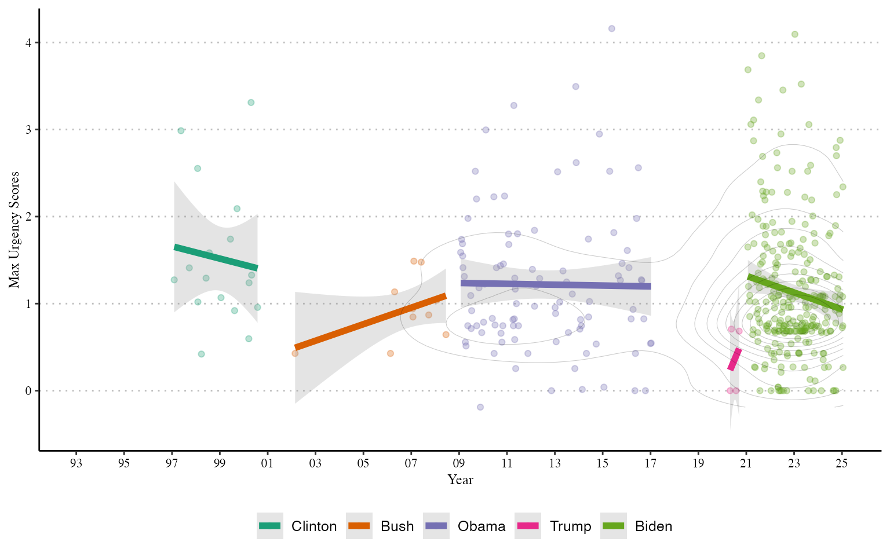
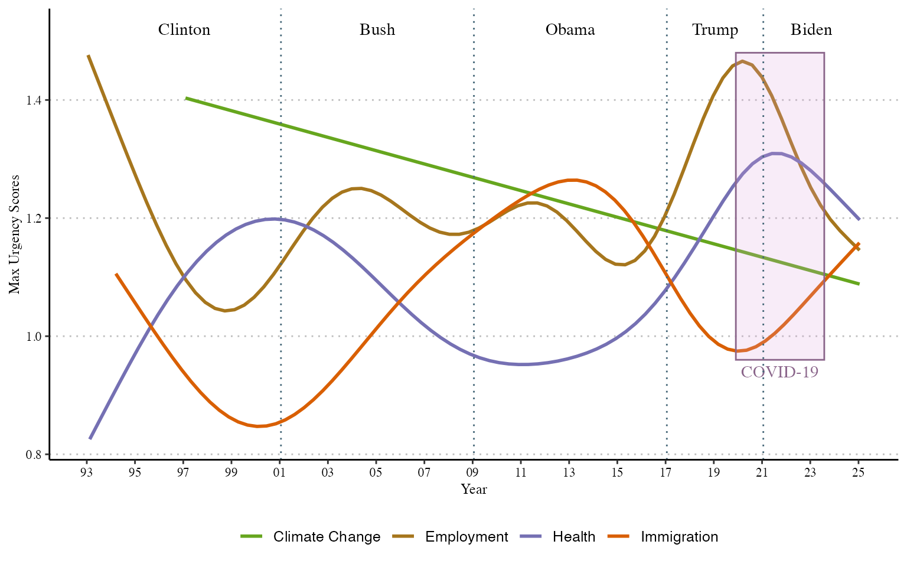

# Is climate change a priority for US presidents?

We investigate how urgently US presidents speak about climate
change-related priorities in 3720 speeches from 1993 to 2025 for Bill
Clinton, George W. Bush, Barack Obama, Donald Trump, and Joe Biden
during the periods they were in office. The period captures the entrance
of climate change into public political discourse and other relevant
external events that might change how climate change priorities are
expressed, such as the 2008 recession, the Paris Agreement signing in
2015, and the COVID pandemic. The texts were collected from the American
Presidency Project and include official speeches and remarks at domestic
and international press conferences. We identify 867 climate
change-related priorities in these texts where terms such as climate
change, global warming, carbon emissions, and clean energy were
mentioned.

## Do we see different patterns in how presidents express the urgency of climate change?

Presidents’ rhetorical styles might affect how they communicate the
urgency of climate change. For example, one president might favour
emphasising urgency through terms from one dictionary while others might
use a broader vocabulary. Below, we fit ordinary least squares models to
different urgency dimensions by president and over time. The models
suggest that presidents do not differ much in their use of urgency
dimensions. Countering a general trend to offering less commitment over
time, Obama and Biden exhibit significantly higher levels of commitment
than Clinton. Bush and Trump use intensity significantly less than
Clinton.

|          | Commitment | Timing    | Frequency | Intensity |
|----------|------------|-----------|-----------|-----------|
| Bush     | 1.076      | -0.234    | 0.046     | -1.862\*  |
|          | (0.716)    | (1.404)   | (0.091)   | (0.819)   |
| Obama    | 1.713\*    | 1.638     | -0.036    | -1.598+   |
|          | (0.732)    | (1.436)   | (0.093)   | (0.837)   |
| Trump    | 1.387      | 1.107     | -0.044    | -3.357\*  |
|          | (1.425)    | (2.793)   | (0.180)   | (1.629)   |
| Biden    | 2.950\*    | 2.892     | -0.073    | -2.009    |
|          | (1.172)    | (2.298)   | (0.148)   | (1.340)   |
| Year     | -0.126\*\* | -0.172+   | 0.004     | 0.072     |
|          | (0.048)    | (0.094)   | (0.006)   | (0.055)   |
| Num.Obs. | 867        | 867       | 867       | 867       |
| R2       | 0.010      | 0.010     | 0.002     | 0.011     |
| R2 Adj.  | 0.004      | 0.004     | -0.004    | 0.005     |
| AIC      | 3779.2     | 4946.8    | 193.9     | 4011.5    |
| BIC      | 3812.6     | 4980.1    | 227.2     | 4044.9    |
| Log.Lik. | -1882.607  | -2466.386 | -89.942   | -1998.755 |
| RMSE     | 2.12       | 4.16      | 0.27      | 2.43      |

## How has the overall urgency climate change-related priorities evolved in American presidential speeches since 1993?

The maximum urgency that presidents spoke of climate change when they
spoke of climate change while in office is shown below. Climate change
appears more often in presidential speeches during Obama and especially
Biden’s presidencies, but interestingly Clinton spoke of climate change
consistently with higher urgency. Whereas Democratic presidents spoke of
climate change as though it were something that \`must’ be addressed, or
more, Republican presidents rarely talked about climate change as a
political priority while in office, except towards the end of their
terms in office. Bush and, especially, Trump talked about climate change
as something considerably less urgent.

## How does the urgency in which American presidents speak of climate change-related priorities compare to priorities across other relevant issue-domains in politics?

The urgency of the 867 climate change-related priorities over time by US
presidents compared to 5950 employment, 2520 health, and 724 immigration
ones since 1993 is presented below. Climate change-related priorities
have gradually become less urgent over time. By contrast, trends for
employment, health, and immigration exhibit greater temporal variation.
The urgency of employment-related priorities generally decreased under
Clinton. Although employment remains a high priority for Bush and Obama,
we do not see a big spike in urgency around the 2008 recession. The
urgency of employment priorities spike under Trump, becoming his most
important priority even amidst the beginning of the COVID-19 pandemic.
Once Biden takes office, however, we see a significant decline in the
urgency of employment. When it comes to health-related priorities, we
see an unprecedented increase in their urgency from the mid-2010s
onward. The urgency of health priorities peaked during the pandemic.
Immigration follows a different pattern, appearing almost
counter-cyclical to employment and health priorities. Although migration
was at the center of Trump’s political agenda during his campaign, while
in office he often refereed to these policies in the past tense and not
as a future priority.

For more on details on this case study please see:

    "Sposito, Henrique, Jael Tan, James Hollway. 2026 [Forthcoming]. How urgent are
    priorities? Comparing political priorities in discourse. European Journal of
    Political Research."

Please do not forget to cite us if you are using poldis ;)
